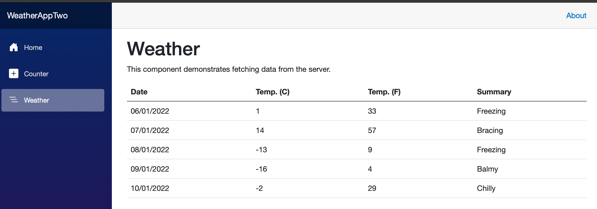

# Full stack tasks

We are going to add missing code, fix some minor problems in app setup and discuss the code. Those are typical tasks in our dev teams, when working on features in web-based platform.

## Todo App: backend task

Simple TodoApp (backend + client) requires minor additions and fixes. Client app is written in Blazor, but let's do not pay much attention to which tech stack was used to write the client app. This part works and serves only as working example for us.

- all CRUD actions implementation are missing in the controller methods, only endpoint mappings are in place. All calls return 404 status, as no work has been done on actual code returning data from in-memory database.
- client application cannot communicate with backend. Why?
- main client styling is broken, it looks the Bootstrap (getbootstrap.com) stylesheet is gone.

Everything else is in place and working as expected, not other fixes needed.

## Weather app: display data in Angular

.NET platform templates ships sample weather app. Let's use those app sample data and display in the table:


- let's use online code editor: https://stackblitz.com
- start with Angular template of your choice. We are using v17.1 in the platform.
- - to use Angular with non-standalone components, start with this template:https://stackblitz.com/edit/angular-15-starter-pack-vkw5s2?file=src%2Fapp%2Fapp.component.ts
- create data file in the project and save this JSON:

```json
[
  {
    "date": "2022-01-06",
    "temperatureC": 1,
    "summary": "Freezing"
  },
  {
    "date": "2022-01-07",
    "temperatureC": 14,
    "summary": "Bracing"
  },
  {
    "date": "2022-01-08",
    "temperatureC": -13,
    "summary": "Freezing"
  },
  {
    "date": "2022-01-09",
    "temperatureC": -16,
    "summary": "Balmy"
  },
  {
    "date": "2022-01-10",
    "temperatureC": -2,
    "summary": "Chilly"
  }
]
```
- create a service that uses this data and returns as results of a method call. No HTTP call required, just use this static file data.
- create a component that consumes the service, calls the services and display data in a table
- use either semantic table tag or markup of your choice
- apply style to the table using Bootstrap (getboostrap.com)
- note that screenshot of Microsoft provided sample app uses computed values for temperature in Fahrenheit degrees. Use Angular built-in solution to transform data on the fly.

Thanks!
